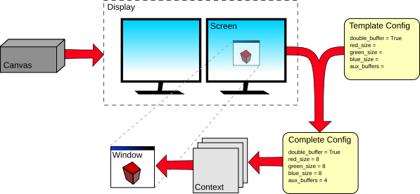
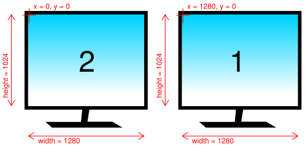

Creating a rendering context
============================

This section describes how to configure a rendering context. For most
applications this is handled automatically, but advanced applications can use
these options for finer control. OpenGL-family configuration options are
covered in detail below.

Displays, screens, configs and contexts
---------------------------------------

    Flow of construction, from the abstract Display to a newly
    created Window with its Context.

Contexts and configs
^^^^^^^^^^^^^^^^^^^^

When you draw on a window in pyglet, you are drawing to the rendering context
for the active backend. Every window has its own context, created when the
window is created. You can access it via
:attr:`~pyglet.window.Window.context`.

For OpenGL-family backends, the context is created from a configuration
(or "config"), which describes properties such as color format and buffer
layout. You can access the config used by a window via
:attr:`~pyglet.window.Window.config` (or ``window.context.config``).

For example, here we create a window using the default config and examine some
of its properties::

    >>> import pyglet
    >>> window = pyglet.window.Window()
    >>> context = window.context
    >>> config = context.config
    >>> config.double_buffer
    c_int(1)
    >>> config.stereo
    c_int(0)
    >>> config.sample_buffers
    c_int(0)

Note that the values of the config's attributes are all ctypes instances.
This is because the config was not specified by pyglet.  Rather, it has been
selected by pyglet from a list of configs supported by the system.  You can
make no guarantee that a given config is valid on a system unless it was
provided to you by the system.

pyglet simplifies config selection by allowing you to request only the
attributes you care about and letting the window choose a compatible result.
See :ref:`guide_simple-context-configuration` for details.

.. _guide_displays:

Displays
^^^^^^^^

The system may actually support several different sets of configs, depending on
which display device is being used.  For example, a computer with two video
cards may not support the same configs on each card.  Another example is using
X11 remotely: the display device will support different configurations than the
local driver.  Even a single video card on the local computer may support
different configs for two monitors plugged in.

In pyglet, a :class:`~pyglet.display.Display` is a collection of "screens"
attached to a single display device.  On Linux, the display device corresponds
to the X11 display being used.  On Windows and Mac OS X, there is only one
display (as these operating systems present multiple video cards as a single
virtual device).

The :mod:`pyglet.display` module provides access to the display(s). Use the
:func:`~pyglet.display.get_display` function to get the default display::

    >>> display = pyglet.display.get_display()

.. note::

    On X11, you can use the :class:`~pyglet.display.Display` class directly to
    specify the display string to use, for example to use a remotely connected
    display.  The name string is in the same format as used by the ``DISPLAY``
    environment variable::

        >>> display = pyglet.display.Display(name=':1')

    If you have multiple physical screens and you're using Xinerama, see
    :ref:`guide_screens` to select the desired screen as you would for Windows
    and Mac OS X. Otherwise, you can specify the screen number via the
    ``x_screen`` argument::

        >>> display = pyglet.display.Display(name=':1', x_screen=1)

.. _guide_screens:

Screens
^^^^^^^

Once you have obtained a display, you can enumerate the screens that are
connected.  A screen is the physical display medium connected to the display
device; for example a computer monitor, TV or projector.  Most computers will
have a single screen, however dual-head workstations and laptops connected to
a projector are common cases where more than one screen will be present.

In the following example the screens of a dual-head workstation are listed::

    >>> for screen in display.get_screens():
    ...     print(screen)
    ...
    XlibScreen(screen=0, x=1280, y=0, width=1280, height=1024, xinerama=1)
    XlibScreen(screen=0, x=0, y=0, width=1280, height=1024, xinerama=1)

Because this workstation is running Linux, the returned screens are
``XlibScreen``, a subclass of :class:`~pyglet.display.Screen`. The
``screen`` and ``xinerama`` attributes are specific to Linux, but the
:attr:`~pyglet.display.Screen.x`, :attr:`~pyglet.display.Screen.y`,
:attr:`~pyglet.display.Screen.width` and
:attr:`~pyglet.display.Screen.height` attributes are present on all screens,
and describe the screen's geometry, as shown below.

    Example arrangement of screens and their reported geometry.  Note that the
    primary display (marked "1") is positioned on the right, according to this
    particular user's preference.

There is always a "default" screen, which is the first screen returned by
:meth:`~pyglet.display.Display.get_screens`.  Depending on the operating system,
the default screen is usually the one that contains the taskbar (on Windows) or
menu bar (on OS X).
You can access this screen directly using
:meth:`~pyglet.display.Display.get_default_screen`.

.. _guide_glconfig:

OpenGL configuration options
----------------------------

When configuring or selecting an OpenGL config, you do so based on the
properties of ``pyglet.config.Config.opengl`` (or ``.gl2``/``.gles2``/``.gles3``).
pyglet supports a fixed subset of the
options provided by AGL, GLX, WGL and their extensions.  In particular, these
constraints are placed on all OpenGL configs:

* Buffers are always component (RGB or RGBA) color, never palette indexed.
* The "level" of a buffer is always 0 (this parameter is largely unsupported
  by modern OpenGL drivers anyway).
* There is no way to set the transparent color of a buffer (again, this
  GLX-specific option is not well supported).
* There is no support for pbuffers (equivalent functionality can be achieved
  much more simply and efficiently using framebuffer objects).

The visible portion of the buffer, sometimes called the color buffer, is
configured with the following attributes:

    ``buffer_size``
        Number of bits per sample.  Common values are 24 and 32, which each
        dedicate 8 bits per color component.  A buffer size of 16 is also
        possible, which usually corresponds to 5, 6, and 5 bits of red, green
        and blue, respectively.

        Usually there is no need to set this property, as the device driver
        will select a buffer size compatible with the current display mode
        by default.
    ``red_size``, ``blue_size``, ``green_size``, ``alpha_size``
        These each give the number of bits dedicated to their respective color
        component.  You should avoid setting any of the red, green or blue
        sizes, as these are determined by the driver based on the
        ``buffer_size`` property.

        If you require an alpha channel in your color buffer (for example, if
        you are compositing in multiple passes) you should specify
        ``alpha_size=8`` to ensure that this channel is created.
    ``sample_buffers`` and ``samples``
        Configures the buffer for multisampling (MSAA), in which more than
        one color sample is used to determine the color of each pixel,
        leading to a higher quality, antialiased image.

        Enable multisampling (MSAA) by setting ``sample_buffers=1``, then
        give the number of samples per pixel to use in ``samples``.
        For example, ``samples=2`` is the fastest, lowest-quality multisample
        configuration. ``samples=4`` is still widely supported
        and fairly performant even on Intel HD and AMD Vega.
        Most modern GPUs support 2×, 4×, 8×, and 16× MSAA samples
        with fairly high performance.

    ``stereo``
        Creates separate left and right buffers, for use with stereo hardware.
        Only specialised video hardware such as stereoscopic glasses will
        support this option.  When used, you will need to manually render to
        each buffer, for example using `glDrawBuffers`.
    ``double_buffer``
        Create separate front and back buffers.  Without double-buffering,
        drawing commands are immediately visible on the screen, and the user
        will notice a visible flicker as the image is redrawn in front of
        them.

        It is recommended to set ``double_buffer=True``, which creates a
        separate hidden buffer to which drawing is performed.  When the
        `Window.flip` is called, the buffers are swapped,
        making the new drawing visible virtually instantaneously.

In addition to the color buffer, several other buffers can optionally be
created based on the values of these properties:

    ``depth_size``
        A depth buffer is usually required for 3D rendering.  The typical
        depth size is 24 bits.  Specify ``0`` if you do not require a depth
        buffer.
    ``stencil_size``
        The stencil buffer is required for masking the other buffers and
        implementing certain volumetric shadowing algorithms.  The typical
        stencil size is 8 bits; or specify ``0`` if you do not require it.
    ``accum_red_size``, ``accum_blue_size``, ``accum_green_size``, ``accum_alpha_size``
        The accumulation buffer can be used for simple antialiasing,
        depth-of-field, motion blur and other compositing operations.  Its use
        nowadays is being superseded by the use of floating-point textures,
        however it is still a practical solution for implementing these
        effects on older hardware.

        If you require an accumulation buffer, specify ``8`` for each
        of these attributes (the alpha component is optional, of course).
    ``aux_buffers``
        Each auxiliary buffer is configured the same as the colour buffer.
        Up to four auxiliary buffers can typically be created.  Specify ``0``
        if you do not require any auxiliary buffers.

        Like the accumulation buffer, auxiliary buffers are used less often
        nowadays as more efficient techniques such as render-to-texture are
        available.  They are almost universally available on older hardware,
        though, where the newer techniques are not possible.

If you wish to work with OpenGL directly, you can request a higher level
context. This is required if you wish to work with the modern OpenGL
programmable pipeline. Please note, however, that pyglet currently uses
legacy OpenGL functionality for many of its internal modules (such as
the text, graphics, and sprite modules). Requesting a higher version
context will currently prevent usage of these modules.

    ``major_version``
        This will be either 3 or 4, for an OpenGL 3.x or 4.x context.
    ``minor_version``
        The requested minor version of the context. In some cases, the OpenGL
        driver may return a higher version than requested.
    ``forward_compatible``
        Setting this to `True` will ask the driver to exclude legacy OpenGL
        features from the context. Khronos does not recommend this option.

.. note::
   On macOS, requesting higher OpenGL versions can be more restrictive than on
   other platforms and may depend on driver and platform constraints.

The default configuration
^^^^^^^^^^^^^^^^^^^^^^^^^

If you create a :class:`~pyglet.window.Window` without specifying the context
or config, pyglet will use a default backend config with the following properties:

    .. list-table::
        :header-rows: 1

        * - Attribute
          - Value
        * - double_buffer
          - True
        * - depth_size
          - 24

.. _guide_simple-context-configuration:

Simple context configuration
----------------------------

A context can only be created from a config that was provided by the system.
Enumerating and comparing all possible configs is platform-specific, so pyglet
provides a simpler interface based on user configuration objects.

To request specific attributes, construct :class:`~pyglet.config.Config`,
set values on the backend-specific entry (such as ``config.opengl``), and pass
it to :class:`~pyglet.window.Window`.

For example, to create a window with an alpha channel::

    config = pyglet.config.Config()
    config.opengl.alpha_size = 8
    window = pyglet.window.Window(config=config)

You can predefine settings for multiple backends in the same object::

    config = pyglet.config.Config()
    config.opengl.major_version = 4
    config.opengl.minor_version = 1
    config.gl2.double_buffer = True
    window = pyglet.window.Window(config=config)

Not all requested configs will be possible on all machines. Window creation
raises
:class:`~pyglet.window.NoSuchConfigException` if the hardware does not
support the requested attributes.

You can use this to support newer hardware features where available, but also
accept a lesser config if necessary.  For example, the following code creates
a window with multisampling if possible, otherwise leaves multisampling off::

    multisample = pyglet.config.Config()
    multisample.opengl.sample_buffers = 1
    multisample.opengl.samples = 4

    fallback = pyglet.config.Config()
    fallback.opengl.depth_size = 24

    window = pyglet.window.Window(config=[multisample, fallback])

Selecting config priority
-------------------------

Passing an iterable of :class:`~pyglet.config.Config` lets you define a
priority order. pyglet tries each config in order and uses the first one that
can be matched by the active backend.

Sharing objects between contexts
--------------------------------

Every window in pyglet has its own rendering context. Each context has its own
backend state. However,
contexts can optionally share their objects with one or more other contexts.
Shareable objects include:

* Textures
* Display lists
* Shader programs
* Vertex and pixel buffer objects
* Framebuffer objects

There are two reasons for sharing objects.  The first is to allow objects to
be stored on the video card only once, even if used by more than one window.
For example, you could have one window showing the actual game, with other
"debug" windows showing the various objects as they are manipulated.  Or, a
set of widget textures required for a GUI could be shared between all the
windows in an application.

The second reason is to avoid having to recreate the objects when a context
needs to be recreated.  For example, if the user wishes to turn on
multisampling, it is necessary to recreate the context.  Rather than destroy
the old one and lose all the objects already created, you can

1. Create the new context, sharing object space with the old context, then
2. Destroy the old context.  The new context retains all the old objects.

For OpenGL-family backends, pyglet defines an
:class:`~pyglet.gl.ObjectSpace`: a representation of a collection of objects
used by one or more contexts. Each context has a single object space,
accessible as ``window.context.object_space``.

By default, all contexts share the same object space as long as at least one
context using it is "alive".  If all the contexts sharing an object space are
lost or destroyed, the object space will be destroyed also.  This is why it is
necessary to follow the steps outlined above for retaining objects when a
context is recreated.

When creating backend-specific contexts directly, you can choose which existing
context to share resources with. By default (when using the
:class:`~pyglet.window.Window` constructor), the most recently created
compatible context is used.

It can be useful to keep track of which object space an object was created in.
For example, when you load a font, pyglet caches the textures used and reuses
them; but only if the font is being loaded on the same object space.  The
easiest way to do this is to set your own attributes on the
:py:class:`~pyglet.gl.ObjectSpace` object.

In the following example, an attribute is set on the object space indicating
that game objects have been loaded.  This way, if the context is recreated,
you can check for this attribute to determine if you need to load them again::

    context = pyglet.graphics.api.core.current_context
    object_space = context.object_space
    object_space.my_game_objects_loaded = True

Avoid using attribute names on :class:`~pyglet.gl.ObjectSpace` that begin with
``"pyglet"``, as they may conflict with an internal module.
