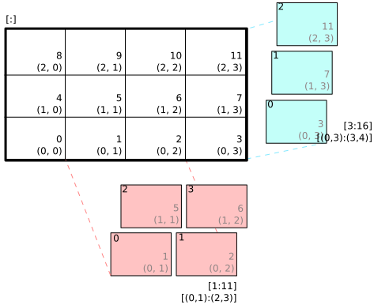

Images and Image Data
=====================

pyglet provides functions for loading and saving images in various formats
using native operating system services. If the `Pillow`_ library is installed,
many additional formats can be supported. pyglet also includes built-in codecs
for loading PNG and BMP without external dependencies.

This page focuses on CPU-side image data, such as loading files and accessing
or modifying pixel bytes. For drawing images or working with GPU textures, see
:doc:`texture`.

.. _Pillow: https://pillow.readthedocs.io

Loading an image
----------------

Images can be loaded using the :py:func:`pyglet.image.load` function::

    kitten = pyglet.image.load('kitten.png')

If you are distributing your application with included images, consider
using the :py:mod:`pyglet.resource` module (see :ref:`guide_resources`).

Without any additional arguments, :py:func:`pyglet.image.load` will
attempt to load the filename specified using any available image decoder.
This allows loading PNG, GIF, JPEG, BMP, DDS, KTX2, and other formats
depending on your operating system and installed modules.
If the image cannot be loaded, an
:py:class:`~pyglet.image.codecs.ImageDecodeException` will be raised.

You can load an image from any file-like object providing a ``read`` method by
specifying the ``file`` keyword parameter::

    kitten_stream = open('kitten.png', 'rb')
    kitten = pyglet.image.load('kitten.png', file=kitten_stream)

In this case the filename ``kitten.png`` is optional, but gives a hint to
the decoder as to the file type (it is otherwise unused when a file object
is provided).

.. note::
    ``image.blit`` and ``Texture.blit`` were removed in pyglet 3.0. To draw
    images, create and draw a :py:class:`~pyglet.sprite.Sprite` (see :doc:`texture`).

Supported image decoders
------------------------
The following table shows common codecs available in pyglet.

    .. list-table::
        :header-rows: 1

        * - Module
          - Class
          - Description
        * - ``pyglet.image.codecs.dds``
          - ``DDSImageDecoder``
          - Reads Microsoft DirectDraw Surface files containing compressed
            textures.
        * - ``pyglet.image.codecs.ktx2``
          - ``KTX2ImageDecoder``
          - Reads Khronos KTX2 compressed texture files.
        * - ``pyglet.image.codecs.wic``
          - ``WICDecoder``
          - Uses Windows Imaging Component services to decode images.
        * - ``pyglet.image.codecs.gdiplus``
          - ``GDIPlusDecoder``
          - Uses Windows GDI+ services to decode images.
        * - ``pyglet.image.codecs.gdkpixbuf2``
          - ``GdkPixbuf2ImageDecoder``
          - Uses GTK GDK-Pixbuf to decode images.
        * - ``pyglet.image.codecs.quartz``
          - ``QuartzImageDecoder``
          - Uses macOS Quartz services to decode images.
        * - ``pyglet.image.codecs.pil``
          - ``PILImageDecoder``
          - Wrapper interface around PIL Image.
        * - ``pyglet.image.codecs.png``
          - ``PNGImageDecoder``
          - PNG decoder written in pure Python.
        * - ``pyglet.image.codecs.bmp``
          - ``BMPImageDecoder``
          - BMP decoder written in pure Python.

Each of these classes registers itself with :py:mod:`pyglet.image` with
the filename extensions it supports. The :py:func:`~pyglet.image.load`
function tries matching extensions first, before attempting other decoders.

Only if every image decoder fails to load an image will :py:class:`~pyglet.image.codecs.ImageDecodeException`
be raised (the origin of the exception will be the first decoder that
was attempted).

You can override this behavior and specify a particular decoding instance.
For example, to always use the pure Python PNG decoder::

    from pyglet.image.codecs.png import PNGImageDecoder
    kitten = pyglet.image.load('kitten.png', decoder=PNGImageDecoder())

Supported image formats
-----------------------

The following table lists common image formats that can be loaded on each
operating system. If Pillow is installed, any additional formats it
supports can also be read. See the `Pillow docs`_ for a list of such formats.

.. _Pillow docs: http://pillow.readthedocs.io/

    .. list-table::
        :header-rows: 1

        * - Extension
          - Description
          - Windows
          - Mac OS X
          - Linux [#linux]_
        * - ``.bmp``
          - Windows Bitmap
          - X
          - X
          - X
        * - ``.dds``
          - Microsoft DirectDraw Surface [#dds]_
          - X
          - X
          - X
        * - ``.gif``
          - Graphics Interchange Format
          - X
          - X
          - X
        * - ``.jpg .jpeg``
          - JPEG/JIFF Image
          - X
          - X
          - X
        * - ``.png``
          - Portable Network Graphic
          - X
          - X
          - X
        * - ``.tif .tiff``
          - Tagged Image File Format
          - X
          - X
          - X
        * - ``.ktx2``
          - Khronos Texture 2
          - X
          - X
          - X

The only built-in save format is PNG, unless Pillow is installed, in which
case additional formats can also be written.

.. [#linux] Requires GTK 2.0 or later for native decoding.
.. [#dds] Only S3TC compressed surfaces are supported. Depth, volume, and cube
          textures are not supported by the DDS loader.

Working with images
-------------------

The :py:func:`pyglet.image.load` function usually returns either
:py:class:`~pyglet.image.ImageData` or
:py:class:`~pyglet.image.CompressedImageData`.

All loaded images have the following attributes:

`width`
    The width of the image, in pixels.
`height`
    The height of the image, in pixels.
`anchor_x`
    Distance of the anchor point from the left edge of the image, in pixels.
`anchor_y`
    Distance of the anchor point from the bottom edge of the image, in pixels.

The anchor point defaults to (0, 0), though some image formats may contain an
intrinsic anchor point.  The anchor point is used to align the image to a
point in space when drawing it.

You may only want to use a portion of an image. You can use
:py:meth:`~pyglet.image.ImageData.get_region` to return a region::

    image_part = kitten.get_region(x=10, y=10, width=100, height=100)

This returns an image with dimensions 100x100. The region extracted from
``kitten`` is aligned so the bottom-left corner of the rectangle is 10 pixels
from the left and 10 pixels from the bottom.

Image regions can be used as regular images. Changes to a region may or may
not be reflected in the source image (and vice versa), so you should not
assume shared write-through behavior.

.. _guide_image-grids:

Image grids
-----------

An "image grid" is a single image which is divided into several smaller images
by drawing an imaginary grid over it. The following image shows an image that
can be used for an asteroid explosion animation.

    An image consisting of eight animation frames arranged in a grid.

This image has one row and eight columns. This is all the information you
need to create an :py:class:`~pyglet.image.ImageGrid` with::

    explosion = pyglet.image.load('explosion.png')
    explosion_seq = pyglet.image.ImageGrid(explosion, 1, 8)

The images within the grid can now be accessed as if they were their own
images::

    frame_1 = explosion_seq[0]
    frame_2 = explosion_seq[1]

Images with more than one row can be accessed either as a single-dimensional
sequence, or as a (row, column) tuple; as shown in the following diagram.

    An image grid with several rows and columns, and the slices that can be
    used to access it.

Image sequences can be sliced like any other sequence in Python. For example,
the following obtains the first four frames in the animation::

    start_frames = explosion_seq[:4]

For efficient rendering, convert the grid into a
:py:class:`~pyglet.graphics.texture.TextureGrid` (see
:ref:`guide_texture-grids`)::

    explosion_tex_seq = pyglet.graphics.TextureGrid.from_image_grid(explosion_seq)

This uses one underlying texture for the entire grid, and each image returned
from a slice is a texture region.

Animations
----------

The :py:class:`~pyglet.image.Animation` class manages a list of
:py:class:`~pyglet.image.AnimationFrame` objects, each of
which references an image and a duration (in seconds).  The storage of
the images is up to the application developer: they can each be discrete, or
packed into a texture atlas, or any other technique.

An animation can be loaded directly from a GIF 89a image file with
:py:func:`~pyglet.image.load_animation` (supported on Linux, Mac OS X
and Windows)
::

    animation = pyglet.image.load_animation('animation.gif')
    first_frame = animation.frames[0]
    duration = first_frame.duration

The animation class is exposed as ``pyglet.image.Animation``
(:py:class:`~pyglet.image.animation.Animation` in the API reference).
To draw animations efficiently, use :py:class:`~pyglet.sprite.Sprite`
(see :doc:`texture`).

Accessing or providing pixel data
---------------------------------

The :py:class:`~pyglet.image.ImageData` class represents an image as pixel
data bytes (or byte-like data), along with details such as pitch and component
layout. You can access :py:class:`~pyglet.image.ImageData` for any image with
:py:meth:`~pyglet.image.ImageData.get_image_data`::

    kitten = pyglet.image.load('kitten.png').get_image_data()

The ``pitch`` and ``format`` properties determine how bytes are arranged.
``pitch`` gives the number of bytes between each consecutive row. Data is
assumed to run left-to-right, bottom-to-top, unless ``pitch`` is negative.

The ``format`` property gives the number and order of color components. It is
a string containing one or more of these letters:

    = =========
    R Red
    G Green
    B Blue
    A Alpha
    L Luminance
    I Intensity
    = =========

For example, a format string of ``"RGBA"`` corresponds to four bytes per
pixel in red/green/blue/alpha order.

To retrieve pixel data in a particular format, use ``get_bytes`` with format
and pitch arguments::

    kitten = kitten.get_image_data()
    data = kitten.get_bytes('RGB', kitten.width * 3)

``data`` is always returned as ``bytes``. To set image data, use ``set_bytes``::

    kitten.set_bytes('RGB', kitten.width * 3, data)

You can also create :py:class:`~pyglet.image.ImageData` directly by supplying
width, height, format, and byte data.

Performance concerns
^^^^^^^^^^^^^^^^^^^^

pyglet can use several methods to transform pixel data from one format to
another. It always tries to select the most efficient route.

If image data is in a non-native format, conversion can require row splitting
and component reordering on the CPU. This can be expensive for large images,
so for performance-sensitive code it is best to keep a stable format/pitch
where possible.

Saving an image
---------------

Any image can be saved using the ``save`` method::

    kitten.save('kitten.png')

or, specifying a file-like object::

    kitten_stream = open('kitten.png', 'wb')
    kitten.save('kitten.png', file=kitten_stream)

To save a screenshot of the current back buffer, see the framebuffer section
in :doc:`texture`.

Animations
----------

While image sequences and atlases provide storage for related images,
they alone are not enough to describe a complete animation.

The :py:class:`~pyglet.image.Animation` class manages a list of
:py:class:`~pyglet.image.AnimationFrame` objects, each of
which references an image and a duration (in seconds).  The storage of
the images is up to the application developer: they can each be discrete, or
packed into a texture atlas, or any other technique.

An animation can be loaded directly from a GIF 89a image file with
:py:func:`~pyglet.image.load_animation` (supported on Linux, Mac OS X
and Windows) or constructed manually from a list of images or an image
sequence using the class methods (in which case the timing information
will also need to be provided).
The :py:func:`~pyglet.image.Animation.add_to_texture_bin` method provides
a convenient way to pack the image frames into a texture bin for efficient
access.

Individual frames can be accessed by the application for use with any kind of
rendering, or the entire animation can be used directly with a
:py:class:`~pyglet.sprite.Sprite` (see next section).

The following example loads a GIF animation and packs the images in that
animation into a texture bin.  A sprite is used to display the animation in
the window::

    window = pyglet.window.Window()

    animation = pyglet.image.load_animation('animation.gif')
    bin = pyglet.graphics.texture.atlas.TextureBin()
    animation.add_to_texture_bin(bin)
    sprite = pyglet.sprite.Sprite(img=animation)

    @window.event
    def on_draw():
        window.clear()
        sprite.draw()

    pyglet.app.run()

When animations are loaded with :py:mod:`pyglet.resource` (see
:ref:`guide_resources`) the frames are automatically packed into a texture bin.

The ``examples/programming_guide/`` folder of the `GitHub repository`_
includes:

* this example program  (``animation.py``)
* a sample GIF animation file  (``dinosaur.gif``)

.. _GitHub repository: https://github.com/pyglet/pyglet/
