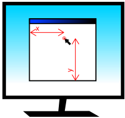

Mouse input
===========

All pyglet windows can receive input from a 3 button mouse with a
2 dimensional scroll wheel.  The mouse pointer is typically drawn by the
operating system, but you can override this and request either a different
cursor shape or provide your own image or animation.

Mouse events
------------

All mouse events are dispatched by the window which receives the event from
the operating system.  Typically this is the window over which the mouse
cursor is, however mouse exclusivity and drag operations mean this is not
always the case.

The coordinate space for the mouse pointer's location is relative to the
bottom-left corner of the window, with increasing Y values approaching the top
of the screen (note that this is "upside-down" compared with many other
windowing toolkits, but is consistent with the default OpenGL projection in
pyglet).

    The coordinate space for the mouse pointer.

The most basic mouse event is :py:meth:`~pyglet.window.Window.on_mouse_motion`
which is dispatched every time the mouse moves::

    def on_mouse_motion(x, y, dx, dy):
        pass

The `x` and `y` parameters give the coordinates of the mouse pointer, relative
to the bottom-left corner of the window.

The event is dispatched every time the operating system registers a mouse
movement.  This is not necessarily once for every pixel moved -- the operating
system typically samples the mouse at a fixed frequency, and it is easy to
move the mouse faster than this.  Conversely, if your application is not
processing events fast enough you may find that several queued-up mouse events
are dispatched in a single :py:meth:`~pyglet.window.Window.dispatch_events`
call. There is no need to concern yourself with either of these issues;
the latter rarely causes problems, and the former can not be avoided.

Many games are not concerned with the actual position of the mouse cursor,
and only need to know in which direction the mouse has moved.  For example,
the mouse in a first-person game typically controls the direction the player
looks, but the mouse pointer itself is not displayed.

The `dx` and `dy` parameters are for this purpose: they give the distance the
mouse travelled along each axis to get to its present position.  This can be
computed naively by storing the previous `x` and `y` parameters after every
mouse event, but besides being tiresome to code, it does not take into account
the effects of other obscuring windows.  It is best to use the `dx` and `dy`
parameters instead.

The following events are dispatched by the Window when a mouse button is
pressed or released, or the mouse is moved while any button is held down::

    def on_mouse_press(x, y, button, modifiers):
        pass

    def on_mouse_release(x, y, button, modifiers):
        pass

    def on_mouse_drag(x, y, dx, dy, buttons, modifiers):
        pass

The `x`, `y`, `dx` and `dy` parameters are as for the
:py:meth:`~pyglet.window.Window.on_mouse_motion` event.
The press and release events do not require `dx` and `dy` parameters as they
would be zero in this case.  The `modifiers` parameter is as for the keyboard
events, see :ref:`guide_keyboard-input`.

The `button` parameter signifies which mouse button was pressed, and is one of
the following constants::

    pyglet.window.mouse.LEFT
    pyglet.window.mouse.MIDDLE
    pyglet.window.mouse.RIGHT

The `buttons` parameter in :py:meth:`~pyglet.window.Window.on_mouse_drag`
is a bitwise combination of all the mouse buttons currently held down.
For example, to test if the user is performing a drag gesture with the
left button::

    from pyglet.window import mouse

    def on_mouse_drag(x, y, dx, dy, buttons, modifiers):
        if buttons & mouse.LEFT:
            pass

When the user begins a drag operation (i.e., pressing and holding a mouse
button and then moving the mouse), the window in which they began the drag
will continue to receive the :py:meth:`~pyglet.window.Window.on_mouse_drag`
event as long as the button is held down.
This is true even if the mouse leaves the window.
You generally do not need to handle this specially: it is a convention
among all operating systems that dragging is a gesture rather than a direct
manipulation of the user interface widget.

There are events for when the mouse enters or leaves a window::

    def on_mouse_enter(x, y):
        pass

    def on_mouse_leave(x, y):
        pass

The coordinates for :py:meth:`~pyglet.window.Window.on_mouse_leave` will
lie outside of your window. These events are not dispatched while a drag
operation is taking place.

The mouse scroll wheel generates the
:py:meth:`~pyglet.window.Window.on_mouse_scroll` event::

    def on_mouse_scroll(x, y, scroll_x, scroll_y):
        pass

The `scroll_y` parameter gives the number of "clicks" the wheel moved, with
positive numbers indicating the wheel was pushed forward.  The `scroll_x`
parameter is 0 for most mice, however some new mice such as the Apple Mighty
Mouse use a ball instead of a wheel; the `scroll_x` parameter gives the
horizontal movement in this case.  The scale of these numbers is not known; it
is typically set by the user in their operating system preferences.

Changing the mouse cursor
-------------------------

The mouse cursor can be set to one of the operating system cursors, a custom
image, or hidden completely.  The change to the cursor will be applicable only
to the window you make the change to.  To hide the mouse cursor, call
:py:meth:`~pyglet.window.Window.set_mouse_visible`::

    win = pyglet.window.Window()
    win.set_mouse_visible(False)

This can be useful if the mouse would obscure text that the user is typing.
If you are hiding the mouse cursor for use in a game environment, consider
making the mouse exclusive instead; see :ref:`guide_mouse-exclusivity`, below.

Use :py:meth:`~pyglet.window.Window.set_mouse_cursor` to change the appearance
of the mouse cursor. A mouse cursor is an instance of
:py:class:`~pyglet.window.MouseCursor`. You can obtain the operating
system-defined cursors with
:py:meth:`~pyglet.window.Window.get_system_mouse_cursor`::

    cursor = win.get_system_mouse_cursor(win.CURSOR_HELP)
    win.set_mouse_cursor(cursor)

The cursors that pyglet defines are listed below, along with their typical
appearance on Windows and Mac OS X.  The pointer image on Linux is dependent
on the window manager.

    .. list-table::
        :header-rows: 1
        :stub-columns: 1
        :class: images

        * - Constant
          - Windows XP
          - Mac OS X
        * - `CURSOR_DEFAULT`
          - .. image:: img/cursor_win_default.png
          - .. image:: img/cursor_mac_default.png
        * - `CURSOR_CROSSHAIR`
          - .. image:: img/cursor_win_crosshair.png
          - .. image:: img/cursor_mac_crosshair.png
        * - `CURSOR_HAND`
          - .. image:: img/cursor_win_hand.png
          - .. image:: img/cursor_mac_hand.png
        * - `CURSOR_HELP`
          - .. image:: img/cursor_win_help.png
          - .. image:: img/cursor_mac_default.png
        * - `CURSOR_NO`
          - .. image:: img/cursor_win_no.png
          - .. image:: img/cursor_mac_no.png
        * - `CURSOR_SIZE`
          - .. image:: img/cursor_win_size.png
          - .. image:: img/cursor_mac_default.png
        * - `CURSOR_SIZE_DOWN`
          - .. image:: img/cursor_win_size_up_down.png
          - .. image:: img/cursor_mac_size_down.png
        * - `CURSOR_SIZE_DOWN_LEFT`
          - .. image:: img/cursor_win_size_nesw.png
          - .. image:: img/cursor_mac_default.png
        * - `CURSOR_SIZE_DOWN_RIGHT`
          - .. image:: img/cursor_win_size_nwse.png
          - .. image:: img/cursor_mac_default.png
        * - `CURSOR_SIZE_LEFT`
          - .. image:: img/cursor_win_size_left_right.png
          - .. image:: img/cursor_mac_size_left.png
        * - `CURSOR_SIZE_LEFT_RIGHT`
          - .. image:: img/cursor_win_size_left_right.png
          - .. image:: img/cursor_mac_size_left_right.png
        * - `CURSOR_SIZE_RIGHT`
          - .. image:: img/cursor_win_size_left_right.png
          - .. image:: img/cursor_mac_size_right.png
        * - `CURSOR_SIZE_UP`
          - .. image:: img/cursor_win_size_up_down.png
          - .. image:: img/cursor_mac_size_up.png
        * - `CURSOR_SIZE_UP_DOWN`
          - .. image:: img/cursor_win_size_up_down.png
          - .. image:: img/cursor_mac_size_up_down.png
        * - `CURSOR_SIZE_UP_LEFT`
          - .. image:: img/cursor_win_size_nwse.png
          - .. image:: img/cursor_mac_default.png
        * - `CURSOR_SIZE_UP_RIGHT`
          - .. image:: img/cursor_win_size_nesw.png
          - .. image:: img/cursor_mac_default.png
        * - `CURSOR_TEXT`
          - .. image:: img/cursor_win_text.png
          - .. image:: img/cursor_mac_text.png
        * - `CURSOR_WAIT`
          - .. image:: img/cursor_win_wait.png
          - .. image:: img/cursor_mac_wait.png
        * - `CURSOR_WAIT_ARROW`
          - .. image:: img/cursor_win_wait_arrow.png
          - .. image:: img/cursor_mac_default.png

Alternatively, you can use your own image as the mouse cursor.  Use
:py:func:`pyglet.image.load` to load the image, then create an
:py:class:`~pyglet.window.ImageMouseCursor` with
the image and "hot-spot" of the cursor.  The hot-spot is the point of the
image that corresponds to the actual pointer location on screen, for example,
the point of the arrow::

    image = pyglet.image.load('cursor.png')
    cursor = pyglet.window.ImageMouseCursor(image, 16, 8)
    win.set_mouse_cursor(cursor)

You can even render a mouse cursor directly with OpenGL.  You could draw a
3-dimensional cursor, or a particle trail, for example.  To do this, subclass
:py:class:`~pyglet.window.MouseCursor` and implement your own draw method.
The draw method will be called with the default pyglet window projection,
even if you are using another projection in the rest of your application.

.. _guide_mouse-exclusivity:

Mouse exclusivity
-----------------

It is possible to take complete control of the mouse for your own application,
preventing it being used to activate other applications.  This is most useful
for immersive games such as first-person shooters.

When you enable mouse-exclusive mode, the mouse cursor is no longer available.
It is not merely hidden -- no amount of mouse movement will make it leave your
application.  Because there is no longer a mouse cursor, the `x` and `y`
parameters of the mouse events are meaningless; you should use only the `dx`
and `dy` parameters to determine how the mouse was moved.

Activate mouse exclusive mode with
:py:meth:`~pyglet.window.Window.set_exclusive_mouse`::

    win = pyglet.window.Window()
    win.set_exclusive_mouse(True)

You should activate mouse exclusive mode even if your window is full-screen:
it will prevent the window "hitting" the edges of the screen, and behave
correctly in multi-monitor setups (a common problem with commercial
full-screen games is that the mouse is only hidden, meaning it can
accidentally travel onto the other monitor where applications are still
visible).

Note that on Linux setting exclusive mouse also disables Alt+Tab and other
hotkeys for switching applications.  No workaround for this has yet been
discovered.
