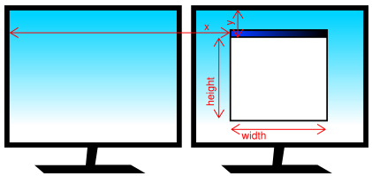

Windowing
=========

A :py:class:`~pyglet.window.Window` in pyglet corresponds to a top-level
window as provided by the operating system. Windows can be floating (with or
without a border), or fullscreen.

.. _guide_creating-a-window:

Creating a window
-----------------

If the :py:class:`~pyglet.window.Window` constructor is called with no
arguments, defaults will be assumed for all parameters::

    window = pyglet.window.Window()

The default parameters used are:

* The window will have a size of 960x540, and not be resizable.
* A default context will be created using the current backend defaults.
* The window caption will be the name of the executing Python script
  (i.e., ``sys.argv[0]``).

Windows are visible as soon as they are created, unless you give the
``visible=False`` argument to the constructor.  The following
example shows how to create and display a window in two steps::

    window = pyglet.window.Window(visible=False)
    # ... perform some additional initialisation
    window.set_visible()

.. _guide_window-config:

Graphics context configuration
^^^^^^^^^^^^^^^^^^^^^^^^^^^^^^

The context of a window cannot be changed once created.  There are several
ways to control the context that is created:

* Supply a :py:class:`~pyglet.config.Config` using the ``config`` argument.
  pyglet selects the backend-specific options that match
  ``pyglet.options.backend``::

      config = pyglet.config.Config()
      config.opengl.alpha_size = 8
      config.opengl.depth_size = 24
      window = pyglet.window.Window(config=config)

  You can set options for multiple backends up front, and pyglet will select
  the matching one at runtime::

      config = pyglet.config.Config()
      config.opengl.major_version = 4
      config.opengl.minor_version = 1
      config.gl2.double_buffer = True
      window = pyglet.window.Window(config=config)

* Supply multiple :py:class:`~pyglet.config.Config` objects in priority order.
  The first compatible config is used::

      high_quality = pyglet.config.Config()
      high_quality.opengl.sample_buffers = 1
      high_quality.opengl.samples = 4

      fallback = pyglet.config.Config()
      fallback.opengl.depth_size = 24

      window = pyglet.window.Window(config=[high_quality, fallback])

* Specify a :py:class:`~pyglet.display.Screen` using the ``screen`` argument.
  The context will use a config created from default backend configuration
  and this screen::

      display = pyglet.display.get_display()
      screen = display.get_screens()[screen_number]
      window = pyglet.window.Window(screen=screen)

* Specify a :py:class:`~pyglet.display.Display` using the ``display`` argument.
  The default screen on this display will be used to obtain a context using
  the default backend configuration::

      display = platform.get_display(display_name)
      window = pyglet.window.Window(display=display)

If no compatible config can be matched, window creation raises
:py:class:`~pyglet.window.NoSuchConfigException`.

Fullscreen windows
^^^^^^^^^^^^^^^^^^

If the ``fullscreen=True`` argument is given to the window constructor, the
window will draw to an entire screen rather than a floating window.  No window
border or controls will be shown, so you must ensure you provide some other
means to exit the application.

By default, the default screen on the default display will be used, however
you can optionally specify another screen to use instead.  For example, the
following code creates a fullscreen window on the secondary screen::

    screens = display.get_screens()
    window = pyglet.window.Window(fullscreen=True, screen=screens[1])

There is no way to create a fullscreen window that spans more than one window
(for example, if you wanted to create an immersive 3D environment across
multiple monitors).  Instead, you should create a separate fullscreen window
for each screen and attach identical event handlers to all windows.

Windows can be toggled in and out of fullscreen mode with the
:py:meth:`~pyglet.window.Window.set_fullscreen`
method.  For example, to return to windowed mode from fullscreen::

    window.set_fullscreen(False)

The previous window size and location, if any, will attempt to be restored,
however the operating system does not always permit this, and the window may
have relocated.

Size and position
^^^^^^^^^^^^^^^^^

This section applies only to windows that are not fullscreen.  Fullscreen
windows always have the width and height of the screen they fill.

You can specify the size of a window as the first two arguments to the window
constructor.  In the following example, a window is created with a width of
1280 pixels and a height of 720 pixels::

    window = pyglet.window.Window(1280, 720)

The "size" of a window refers to the drawable space within it, excluding any
additional borders or title bar drawn by the operating system.

You can allow the user to resize your window by specifying ``resizable=True``
in the constructor.  If you do this, you may also want to handle the
:py:meth:`~pyglet.window.Window.on_resize` event::

    window = pyglet.window.Window(resizable=True)

    @window.event
    def on_resize(width, height):
        print(f'The window was resized to {width},{height}')

You can specify a minimum and maximum size that the window can be resized to
by the user with the :py:meth:`~pyglet.window.Window.set_minimum_size` and
:py:meth:`~pyglet.window.Window.set_maximum_size` methods::

    window.set_minimum_size(320, 200)
    window.set_maximum_size(1024, 768)

The window can also be resized programmatically (even if the window is not
user-resizable) with the :py:meth:`~pyglet.window.Window.set_size` method::

    window.set_size(1280, 720)

The window will initially be positioned by the operating system.  Typically,
it will use its own algorithm to locate the window in a place that does not
block other application windows, or cascades with them.  You can manually
adjust the position of the window using the
:py:meth:`~pyglet.window.Window.get_location` and
:py:meth:`~pyglet.window.Window.set_location` methods::

    x, y = window.get_location()
    window.set_location(x + 20, y + 20)

Note that unlike the usual coordinate system in pyglet, the window location is
relative to the top-left corner of the desktop, as shown in the following
diagram:

    The position and size of the window relative to the desktop.

Appearance
----------

Window style
^^^^^^^^^^^^

Non-fullscreen windows can be created in one of six styles: default, dialog,
tool, borderless, transparent, or overlay. Transparent and overlay windows both
set a transparent framebuffer if the graphics card and windowing system both allow it.

    .. list-table::
        :header-rows: 1

        * - Style
          - Windows
          - Mac OS X
        * - :py:attr:`~pyglet.window.Window.WINDOW_STYLE_DEFAULT`
          - .. image:: img/window_xp_default.png
          - .. image:: img/window_osx_default.png
        * - :py:attr:`~pyglet.window.Window.WINDOW_STYLE_DIALOG`
          - .. image:: img/window_xp_dialog.png
          - .. image:: img/window_osx_dialog.png
        * - :py:attr:`~pyglet.window.Window.WINDOW_STYLE_TOOL`
          - .. image:: img/window_xp_tool.png
          - .. image:: img/window_osx_tool.png
        * - :py:attr:`~pyglet.window.Window.WINDOW_STYLE_BORDERLESS`
          - <Image Not Available>
          - .. image:: img/window_osx_borderless.png
        * - :py:attr:`~pyglet.window.Window.WINDOW_STYLE_TRANSPARENT`
          - .. image:: img/window_xp_transparent.png
          - Implemented, not pictured.
        * - :py:attr:`~pyglet.window.Window.WINDOW_STYLE_OVERLAY`
          - .. image:: img/window_xp_overlay.png
          - Implemented, not pictured.

Non-resizable variants of these window styles may appear slightly different
(for example, the maximize button will either be disabled or absent).

Besides the change in appearance, the window styles affect how the window
behaves.  For example, tool windows do not usually appear in the task bar and
cannot receive keyboard focus.  Dialog windows cannot be minimized.

Choosing the appropriate window style for your window means your application should
behave correctly for the platform on which it is running. However, keep in mind, certain window
behaviour is ultimately controlled by the underlying operating system and may have unexpected behavior
depending on your usage. It would be pragmatic to test your use case on all operating systems you plan to
support with your application.

The appearance and behaviour of windows in Linux will vary greatly depending
on the distribution, window manager and user preferences.

Overlay windows (:py:attr:`~pyglet.window.Window.WINDOW_STYLE_OVERLAY`)
require custom sizing and moving of the respective window. By default, overlay's are always on top,
and do not accept mouse clicks.

Borderless windows (:py:attr:`~pyglet.window.Window.WINDOW_STYLE_BORDERLESS`)
are not decorated by the operating system at all, and have no way to be resized
or moved around the desktop.  These are useful for implementing splash screens
or custom window borders.

You can specify the style of the window in the
:py:class:`~pyglet.window.Window` constructor.
Once created, the window style cannot be altered::

    window = pyglet.window.Window(style=pyglet.window.Window.WINDOW_STYLE_DIALOG)

Caption
^^^^^^^

The window's caption appears in its title bar and task bar icon (on Windows
and some Linux window managers).  You can set the caption during window
creation or at any later time using the
:py:meth:`~pyglet.window.Window.set_caption` method::

    window = pyglet.window.Window(caption='Initial caption')
    window.set_caption('A different caption')

Icon
^^^^

The window icon appears in the title bar and task bar icon on Windows and
Linux, and in the dock icon on Mac OS X.  Dialog and tool windows do not
necessarily show their icon.

Windows, Mac OS X and the Linux window managers each have their own preferred
icon sizes:

    Windows XP
        * A 16x16 icon for the title bar and task bar.
        * A 32x32 icon for the Alt+Tab switcher.
    Mac OS X
        * Any number of icons of resolutions 16x16, 24x24, 32x32, 48x48, 72x72
          and 128x128.  The actual image displayed will be interpolated to the
          correct size from those provided.
    Linux
        * No constraints, however most window managers will use a 16x16 and a
          32x32 icon in the same way as Windows XP.

The :py:meth:`~pyglet.window.Window.set_icon` method allows you to set any
number of images as the icon.
pyglet will select the most appropriate ones to use and apply them to
the window.  If an alternate size is required but not provided, pyglet will
scale the image to the correct size using a simple interpolation algorithm.

The following example provides both a 16x16 and a 32x32 image as the window
icon::

    window = pyglet.window.Window()
    icon1 = pyglet.image.load('16x16.png')
    icon2 = pyglet.image.load('32x32.png')
    window.set_icon(icon1, icon2)

You can use images in any format supported by pyglet, however it is
recommended to use a format that supports alpha transparency such as PNG.
Windows .ico files are supported only on Windows, so their use is discouraged.
Mac OS X .icons files are not supported at all.

Note that the icon that you set at runtime need not have anything to do with
the application icon, which must be encoded specially in the application
binary (see `Self-contained executables`).

Visibility
----------

Windows have several states of visibility.  Already shown is the
:py:attr:`~pyglet.window.Window.visible` property which shows or hides
the window.

Windows can be minimized, which is equivalent to hiding them except that
they still appear on the taskbar (or are minimised to the dock, on OS X).
The user can minimize a window by clicking the appropriate button in the
title bar.
You can also programmatically minimize a window using the
:py:class:`~pyglet.window.Window.minimize` method (there is also a
corresponding :py:class:`~pyglet.window.Window.maximize` method).

When a window is made visible the :py:meth:`~pyglet.window.Window.on_show`
event is triggered.  When it is hidden the
:py:meth:`~pyglet.window.Window.on_hide` event is triggered.
On Windows and Linux these events
will only occur when you manually change the visibility of the window or when
the window is minimized or restored.  On Mac OS X the user can also hide or
show the window (affecting visibility) using the Command+H shortcut.

File dialogs
------------

Use :py:class:`~pyglet.window.dialog.FileOpenDialog` and
:py:class:`~pyglet.window.dialog.FileSaveDialog` to open native system file
dialogs from your pyglet application.

These dialogs are non-blocking and dispatch events when the user completes or
cancels the operation. They only return path information; your code is
responsible for opening or saving the file data.

Both :py:class:`FileOpenDialog` and :py:class:`FileSaveDialog` accept
``filetypes`` as a list of ``(label, pattern)`` tuples.

Use wildcard patterns (recommended), and separate multiple extensions in one
entry with spaces::

    filetypes = [
        ("PNG Image", "*.png"),
        ("Images", "*.png *.jpg *.bmp"),
        ("All Files", "*.*"),
    ]

Simple extensions (like ``".png"``) are also accepted.

Open file dialog example::

    import pyglet
    from pyglet.window import key
    from pyglet.window.dialog import FileOpenDialog

    window = pyglet.window.Window()

    open_dialog = FileOpenDialog(
        title="Open image(s)",
        filetypes=[("Images", "*.png *.jpg *.bmp"), ("All Files", "*.*")],
        multiple=True,
    )

    @open_dialog.event
    def on_dialog_open(filenames):
        if not filenames:
            return  # User canceled
        print("Selected files:", filenames)

    @window.event
    def on_key_press(symbol, modifiers):
        if symbol == key.O:
            open_dialog.open()

    pyglet.app.run()

Save file dialog example::

    import pyglet
    from pyglet.window import key
    from pyglet.window.dialog import FileSaveDialog

    window = pyglet.window.Window()

    save_dialog = FileSaveDialog(
        title="Save scene",
        filetypes=[("Scene Files", "*.json"), ("All Files", "*.*")],
        default_ext=".json",
        initial_file="scene",
    )

    @save_dialog.event
    def on_dialog_save(filename):
        if not filename:
            return  # User canceled
        print("Save to:", filename)

    @window.event
    def on_key_press(symbol, modifiers):
        if symbol == key.S and modifiers & key.MOD_CTRL:
            save_dialog.open()

    pyglet.app.run()

.. note:: ``initial_file`` is not supported by macOS for
:py:class:`~pyglet.window.dialog.FileOpenDialog`.

Clipboard access
----------------

Pyglet offers very basic clipboard access.

Use :py:meth:`~pyglet.window.Window.set_clipboard_text` to set the clipboard
text string and :py:meth:`~pyglet.window.Window.get_clipboard_text` to retrieve
plain-text to the clipboard.

Clipboard support is text-only through this API. If no text is available,
:py:meth:`~pyglet.window.Window.get_clipboard_text` returns an empty string.

.. note:: On some Linux distributions, it has been reported that some clipboard managers
may interfere with the setting or retrieving of clipboard data.

.. _guide_subclassing-window:

Subclassing Window
------------------

A useful pattern in pyglet is to subclass :py:class:`~pyglet.window.Window` for
each type of window you will display, or as your main application class.  There
are several benefits:

* You can load font and other resources from the constructor, ensuring the
  rendering context has already been created.
* You can add event handlers simply by defining them on the class.  The
  :py:meth:`~pyglet.window.Window.on_resize` event will be called as soon as
  the window is created (this
  doesn't usually happen, as you must create the window before you can attach
  event handlers).
* There is reduced need for global variables, as you can maintain application
  state on the window.

The following example shows the same "Hello World" application as presented
in :ref:`quickstart`, using a subclass of :py:class:`~pyglet.window.Window`::

    class HelloWorldWindow(pyglet.window.Window):
        def __init__(self):
            super().__init__()

            self.label = pyglet.text.Label('Hello, world!')

        def on_draw(self):
            self.clear()
            self.label.draw()

    if __name__ == '__main__':
        window = HelloWorldWindow()
        pyglet.app.run()

This example program is located in
``examples/programming_guide/window_subclass.py``.

Windows and rendering contexts
------------------------------

Every window in pyglet has an associated rendering context for the active
backend. Specifying the configuration of this context has already been covered in
:ref:`guide_creating-a-window`.
Drawing into that rendering context is the only way to draw into the window's
client area.

Double-buffering
^^^^^^^^^^^^^^^^

If the window is double-buffered (i.e., the configuration specified
``double_buffer=True``, the default), rendering commands are applied to a hidden
back buffer. This back buffer can be brought to the front using the `flip`
method. The previous front buffer then becomes the hidden back buffer
we render to in the next frame. If you are using the standard `pyglet.app.run`
or :py:class:`pyglet.app.EventLoop` event loop, this is taken care of
automatically after each :py:meth:`~pyglet.window.Window.on_draw` event.

If the window is not double-buffered, the
:py:meth:`~pyglet.window.Window.flip`  operation is unnecessary,
and you should remember only to call :py:func:`pyglet.graphics.api.gl.glFlush` to
ensure buffered commands are executed.

Vertical retrace synchronisation
^^^^^^^^^^^^^^^^^^^^^^^^^^^^^^^^

Double-buffering eliminates one cause of flickering: the user is unable to see
the image as it is painted, only the final rendering.  However, it does introduce
another source of flicker known as "tearing".

Tearing becomes apparent when displaying fast-moving objects in an animation.
The buffer flip occurs while the video display is still reading data from the
framebuffer, causing the top half of the display to show the previous frame
while the bottom half shows the updated frame.  If you are updating the
framebuffer particularly quickly you may notice three or more such "tears" in
the display.

pyglet provides a way to avoid tearing by synchronising buffer flips to the
video refresh rate.  This is enabled by default, but can be set or unset
manually at any time with the :py:attr:`~pyglet.window.Window.vsync` (vertical
retrace synchronisation)
property.  A window is created with vsync initially disabled in the following
example::

    window = pyglet.window.Window(vsync=False)

It is usually desirable to leave vsync enabled, as it results in flicker-free
animation.  There are some use-cases where you may want to disable it, for
example:

* Profiling an application.  Measuring the time taken to perform an operation
  will be affected by the time spent waiting for the video device to refresh,
  which can throw off results.  You should disable vsync if you are measuring
  the performance of your application.
* If you cannot afford for your application to block.  If your application run
  loop needs to quickly poll a hardware device, for example, you may want to
  avoid blocking with vsync.
