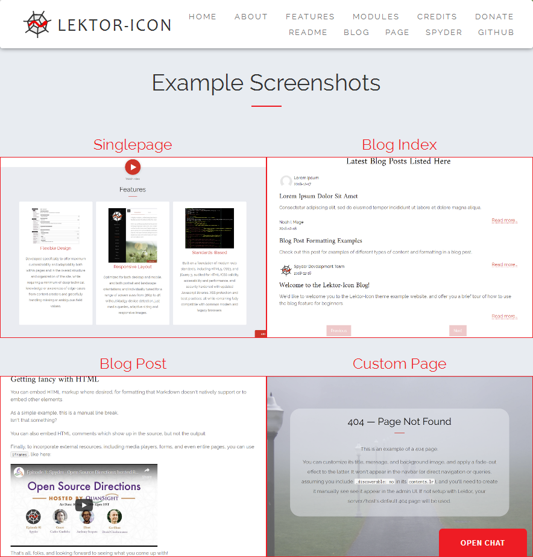

# Lektor-Icon Theme

*Copyright © 2016-2019 Lektor-Icon Contributors and others (see [AUTHORS.txt](https://github.com/spyder-ide/lektor-icon/blob/master/AUTHORS.txt))*



This a heavily modified and expanded version of the [FreeHTML5](https://freehtml5.co/) ["Icon" template](https://freehtml5.co/icon-free-website-template-using-bootstrap/) ported to the [Lektor](https://www.getlektor.com/) static CMS by [Daniel Althviz](https://dalthviz.github.io/) and the [Spyder](https://www.spyder-ide.org/) development team; it was initially derived from the [Hugo port](https://github.com/SteveLane/hugo-icon) of the Icon theme by [Steve Lane](https://gtown-ds.netlify.com/).
The core template is a single-page, responsive layout, with sections for describing your organization and its mission, services, a gallery, your team and how visitors can download your software or donate to your cause.
It also features additions including a built-in blog, generic page template, custom error page, common navbar, Gitter, Disqus, RSS/Atom and OpenCollective integration, heavy customizability, numerous fixes and improvements, and re-written for speed, extensibility, responsiveness and conformance.
The theme is designed to be more desktop and mobile-friendly, and designed and tested to smoothly adapt to a wide variety of viewport sizes from well below 480px all the way to 4K, and closely follows modern web standards while still offering compatibility with a wide range of modern and legacy browsers.


## Installation

See the [Lektor theme docs](https://www.getlektor.com/docs/themes/).
We recommend installing Lektor-Icon as a Git submodule, as we often update and improve it from time to time.
The theme should support Lektor versions 3.1.0 and later like any other, but we recommend Lektor 3.1.2 for the best results since it has been most extensively tested with that version, and we plan to update it with the responsive image improvements in the next version of Lektor when those become available.

No plugins are required with the default settings, but enabling support for Disqus comments and a RSS/Atom feed for the blog naturally demands the inclusion of those appropriate package names in the ``[packages]`` section of your ``.lektorproject`` file.
The theme doesn't depend on any ``.lektorproject`` settings aside from its own ``[theme_settings]`` configuration to function properly, and rather uses its own where needed, so you are free to keep its configuration variables fully separate from any you may make use of.


## Basic Setup

### Quickstart

To get a baseline site up and running fast and start playing around with what the theme can do, your quickest option is to just copy the example site's ``content`` directory to your own and edit away.
By default, the sample site has a variety of information about the theme and how to use it to help you make the most of its features and capabilities.
The main "Single Page Site" template is ``singlepage``, more conventional pages can be created with the ``page`` template, a blog and posts to it can be added with the respective ``blog`` and ``blog-post`` templates, centralized author management is implemented with the ``authors`` and ``author`` templates, and there's also a ``404`` template for a custom error page.
That said, if you're already familiar with how to organize your site, want to better understand how the pieces fit together by doing it from scratch or is just the type who likes to "do it yourself", the following step-by-step procedure should guide you through the process.


### Step by Step Manual Setup

All steps aside from the first are entirely optional, depending on what pages and content you'd like to include, and the site should build successfully without anything else starting from that step.
Except for the initial creation of one-off pages (homepage, blog index, authors index and 404.html), all steps can performed from the Lektor admin GUI, if you so choose (aside from the obvious exclusions of configuring global theme settings and plugins, and copying in image assets and editing custom CSS stylesheets that Lektor doesn't (yet) support from the web GUI).

0. Initialize a new empty Lektor project with a ``.lektorproject`` file and install the theme (see previous section).

1. In the project's ``content`` directory, create a ``contents.lr`` for your homepage, with ``_model: singlepage``.
   You could use a plain ``page`` for your ``_model`` if you really wanted, but most users will want to use the ``singlepage`` model for the full experience.

2. If you'd like to include a blog with your site, make a ``blog`` directory (or use a path  of your choice, however you'd like it to appear in the URL) with a ``contents.lr`` containing ``_model: blog``.
   Set the ``sort_key`` field to a suitable integer for it to appear site's main navbar.
   To add a blog post, create a new subdirectory with the name you'd like for its link, and a ``contents.lr`` with ``_model: blog-post`` inside that.

3. For centralized management of author identities, names and photos, such as for blog posts, create an ``authors`` directory (required name so templates can find it), and a ``contents.lr`` with ``_model: authors`` and ``_discoverable: no`` if you want it to be invisible, or ``_template: page.html`` (or your own custom template) if you want to customize it further and display it to the public.
   To add an individual author, instantiate a subdirectory named the key by which you'd like to refer to that author elsewhere in the site,.
   Inside it, place a ``contents.lr`` of ``_model: author`` for the author's details, along with a profile picture (if desired).

4. To create a new general content page, make a new directory with the name you choose for its URL, and save a ``contents.lr`` with ``_model: page``.
   To make it automatically appear in the main navbar and control its order, set the ``sort_key`` to an appropriate integer.
   Page layout is relatively free-form, so you can fully control the appearance with simple markdown, embedded HTML or with your own custom stylesheet; more advanced users can extend the page model and build their own complex templates.

5. If you'd like a custom error page rather than whatever your server/host provides by default, create a new directory named ``404.html``, and populate it with a ``contents.lr`` of ``_model: 404`` and ``_discoverable: no``, along with a background image, if desired.

Beyond this, you're free to add flowblocks and content to the main singlepage layout as you desire, along with new blog posts (and their authors), content pages, and even your own custom templates.
Have fun exploring what you can do!


## Theme-Level Configuration Settings

While considerable effort has been undertaken to make all practicable settings part of the data models of the relevant pages, to maximize flexibility along with discoverability of settings from the admin GUI and mimize ambiguity and costly full-site re-builds, a few were clearly more appropriate as site-wide options, and this section documents each of them.
As with any theme, they can be set under the ``[theme_settings]`` section of your projects ``.lektorproject`` configuration file, in ``INI`` format.
You can view a full example with all settings present with sensible defaults in the ``example-site`` directory of this theme; feel free to use it as a basis for your own.


### Interpreted datatypes

Since data types in ``INI`` configuration files are all natively strings by default, Lektor-Icon does some custom parsing on various values to convert them to the indicated type.
The following describes the various formats and their parsing rules.

*String:* A basic string; no special interpretion.
Generally converted by ``jinja`` into an HTML-safe representation, escaping problematic characters.
Used when the output should be plain text.

*Safe String:* Like string, except HTML characters are not escaped (treated as ``safe`` by ``jinja``.
Therefore, you can do fancy stuff with it like adding complex tags and markup, but be careful!
You could break the site if you inadvertently include syntactically invalid HTML here.

*URL*: Must be a valid URL, either to a local asset/content (absolute path from the root of the site, e.g. ``/static/images/favicon.png``) or to a full URL remote webpage/resource (``https://www.spyder-ide.org``).
Exact usage and validation depends on context, so see each setting's description for details.

*CSS Color Code*: Can be any valid value you'd use for a CSS color property, such as hex (``#ff0000``), RGB(A) (``rgb(255, 0, 0)``), HSL(A) (``hsla(0.1, 0.5, 0.7, 0.3)``), or a named color (``red``).

*Boolean:* A setting parsed as a boolean.
The algorithm is simple: convert the input to a all-lowercase reprisentation, strip any whitespace, and determine if it matches either ``true``/``t``/``yes``/``y``, or ``false``/``f``/``no``/``n``.
The default (not present or invalid) may be either or even neither; see the description of each setting for details.

*Dictionary:* An ordered dictionary of key-value pairs (each generally treated as string: string or string: URL depending on context), written in Python-style syntax.
The general form is ``key1: value1, key2: value2`` .
Any number of spaces (including zero) between commas are allowed, but exactly one must be preset between the colon (``:``) and the value to allow for any colons (like in ``https:``) that might be present in the key or value text.


### Theme Settings List

``title`` (*string*): The name of the site, which appears in the second portion of the tab title (i.e. ``<Page Name> | <title>``, as part of the ``<title>`` element for each page.
*Example*: ``title = Lektor-Icon Demo Site``

``content_lang`` (*string*): ISO 639 language (locale) code of the site's primary content language.
*Example:* ``content_lang = en-US``

``author`` (*string*): The author of the website.
Used for the ``"author"`` HTML meta tag.
*Example:* ``author = Lektor Icon Contributors``

``copyright`` (*string*): The copyright statement of the website.
Used for the ``"copyright"`` HTML meta tag and the copyright statement in the page footer.
*Example:* ``copyright = &copy; 2019 Lektor-Icon Contributors``

``description`` (*string*): A short (<1 sentance) summary of the site's purpose.
Used for the ``"description"`` HTML meta tag.
*Example:* ``description = Official live demo site for the Lektor-Icon theme``

``keywords`` (*string*): The major keywords describing the website as a comma-separated list.
Used for the ``"keywords"`` HTML meta tag.
*Example:* ``keywords = lektor, theme, example``

``favicon_path`` (*url*): The path to the site's primary favicon.
Typically should be stored in the ``assets/static/`` directory of the source repository, and also repeated (as ``favicon.icon`` in the root of the ``assets`` directory for legacy browsers (i.e. IE).
*Example:* ``favicon_path = /static/images/favicon.png``

``theme_accent_color`` (*CSS color string*): HTML/CSS color code of the desired accent color for the site's main themed elements.
Note: Will not be used on legacy Internet Explorer browsers; the default color (Spyder Red) will be used instead unless a workaround is used.
See Accent Color Theming in the Technical Notes section below for more details.
*Example:* ``theme_accent_color = #ee1c24``

``theme_pipe_color`` (*CSS color string*): HTML/CSS color code of the desired color for the colored pipe characters used through the site, as well as a few minor elements.
Generally recommended to be lighter than the primary theme color, for optimal contrast with the dark footer background.
Note: Will not be used on legacy Internet Explorer browsers; the default color (Spyder Red) will be used instead unless a workaround is used.
See Accent Color Theming in the Technical Notes section below for more details.
*Example:* ``theme_pipe_color = rgb(255, 255, 82)``

``custom_css`` (*url*): Path to a custom stylesheet for the site, if desired.
Loaded last, and thus can be used to customize the look of any desired aspect of the site.
*Example:* ``custom_css = /static/css/example-custom-styles.css``

``content_security_policy`` (*boolean*): Whether to apply a (relatively liberal) Content Security Policy ruleset to the site, to increase its security.
If not set, defaults to ``true``.
Can be further customized with the properties below.
*Example:* ``content_security_policy = true``

``content_security_policy_frame_src`` (*safe string*): String to use instead of the default for the ``frame_src`` rule of the site's CSP (if enabled).
*Example:* ``content_security_policy_frame_src = 'self' http: https:``

``content_security_policy_script_src`` (*safe string*): String to use instead of the default for the ``script_src`` rule of the site's CSP (if enabled).
*Example:* ``content_security_policy_script_src = 'self' 'unsafe-inline'``

``content_security_policy_style_src`` (*safe string*): String to use instead of the default for the ``script_src`` rule of the site's CSP (if enabled).
*Example:* ``content_security_policy_style_src = 'self' https://fonts.googleapis.com 'unsafe-inline'``

``loader_enable`` (*boolean*): Whether to show the animated loading icon for a brief period while any singlepage-theme page is loading.
Defaults to true if not set.
*Example:* ``loader_enable = true``

``nav_logo_path`` (*url*): Path to the logo to use in the top left of the site's main navbar.
Should generally be somewhere in the site's ``assets`` directory.
If not present, no logo will be displayed in favor of just ``nav_logo_text``.
At least of of this and the latter should be present; otherwise no clearly accessible link to the homepage will be easily visible to users (stock text will be generated if this is the case, to avoid this).
*Example:* ``nav_logo_path = /static/images/spyder-logo.svg``

``nav_logo_text`` (*string*): Text to display as the site's name, next to the logo to the left of the top navbar.
If not present, no text will be displayed unless ``nav_logo_path`` also doesn't exist; in that case stock text will be displayed to allow users/you to at least navigate the site properly.
*Example:* ``nav_logo_text = Lektor-Icon``

``nav_extralinks`` (*dictionary*): Dictionary (written in Python style, see above) of extra navigation links to show to the right of the top navbar.
Will be displayed to the right of any other links, in the order listed here.
These can be to other parts or subdomains of your site (generated separately), sites on other platforms (e.g. Github), or third-party resources.
Key is the link title, and value is the link URL.
If not present, no extra links will be displayed.
*Example:* ``nav_extralinks = Spyder: https://www.spyder-ide.org/, Github: https://github.com/spyder-ide/lektor-icon``

``footer_links`` (*dictionary*): Dictionary (written in Python style, see above) of "Connect with Us:" links to be displayed at the top of the site's footer.
You may want to include links to various social media, hosting and/or fundraising platforms here.
Key is the link title, and value is the link URL.
If not present, no "Connect with Us" section of the footer will be displayed.
*Example:* ``footer_links = Github: https://github.com/spyder-ide/lektor-icon, Facebook: https://www.facebook.com/SpyderIDE/, Twitter: https://twitter.com/spyder_ide, Google Groups: https://groups.google.com/forum/?hl=en#!forum/uahuntsvilleams, OpenCollective: https://opencollective.com/spyder``

``footer_license_name`` (*string*): The name of your site's content license(s).
Will be displayed next to ``copyright`` (see above), and linked to the URL below if present.
If not present, no license text will be displayed.
*Example:* ``footer_license_name = MIT (Code); CC-BY-SA 4.0 (Content)``

``footer_license_link`` (*url*): Link to your site's license, either in its canonical form/summary (e.g. on the Creative Commons website), or e.g. the ``LICENSE.txt`` file from your repo itself.
If not present, the license text will not be linked.
*Example:* ``footer_license_link = https://github.com/spyder-ide/lektor-icon/blob/master/LICENSE.txt``

``gitter_room`` (*string*): Name/path to the Gitter room associated with your site (the part of its Gitter URL after ``https://gitter.im/``).
If included, will enable an ``Open Chat`` button on your site that, when clicked, will open a fully interactive sidebar containing a Gitter chat client, allowing them to communicate directly with you to ask questions or give feedback.
If not set, the script will not be enabled and no button will be present.
See the Optional Feature Configuration section for more details.
*Example:* ``gitter_room = spyder-ide/public``

``disqus_name`` (*string*): The name of your Disqus organization on their website.
If set, will globally allow Disqus comments on blogs on your site.
Each individual blog's default (comments on or off) can be set on its configuration page.
Furthermore, this can again be overrided on a per-post basis and comments individually set to on or off.
Also, the ``lektor-disqus-comments`` plugin needs to be installed, and the ``disqus-comments.ini`` file needs to be present in the ``config`` directory of your site for it to work.
If not present, comments will be globally disabled across your site.
See the Optional Feature Configuration section for more details.
*Example:* ``disqus_name = spyder-ide``

``atom_enable`` (*boolean*): Whether to enable generating and displaying a RSS/Atom feed for the site's blog.
Requires the ``lektor-atom`` plugin and using the ``--no-prune`` flag on build, and ``atom.ini`` file needs to be present in the ``config`` directory of your site for it to work.
See the Optional Feature Configuration section for more details.
*Example:* ``atom_enable = true``


## Optional Feature Configuration

Lektor-Icon includes a number of features and integrations that can be optionally enabled if you so desire, that each require a bit of minimal configuration:


### Gitter Chat Sidebar

[Gitter](https://gitter.im/) provides free public and private chatrooms for open-source projects hosted on public repositories, and the Lektor-Icon theme includes an optional button that activates a slide-open chat panel that users of your site can use to ask questions, give feedback, and otherwise interact with you and your organization.
Configuration on this one is simple: All you need to do is enter the name/path of your Gitter room (i.e. the part that appears after ``https://gitter.im/`` in its URL) in the ``.lektorproject [theme_settings]`` and you should see the chat button appear throughout your site.


### Disqus Blog Comments

[Disqus](https://disqus.com/) is a user-interaction platform that can be embedded in websites to allow users to comment on articles and blog posts, and its a built-in option for Lektor-Icon's blog.
To enable it, you need to first create your free (gratis) Disqus community at [Disqus Engage](https://publishers.disqus.com/engage), and register your community name.
Then, you'll need to create a new file under ``configs/disqus-comments.ini`` with ``shortname = YOUR_DISQUS_SHORTNAME`` as the content, include the shortname under ``disqus_name`` in the ``[theme_settings]`` in your ``.lektorproject`` (to enable it in the theme and allow Disqus through CSP), and add ``lektor-disqus-comments = 0.2`` under ``[packages]`` there as well.
Finally, you can either enable comments by default for all posts posts for the blog by setting the ``allow_comments_default`` field to ``yes`` in the Blog configuration page, or you can enable/disable comments for individual blogs with the ``allow_comments`` field on each one.
Check out the [Disqus Comments](https://www.getlektor.com/docs/guides/disqus/) tutorial in the Lektor docs to learn more.


### RSS/Atom Feed for Blog Posts

RSS/Atom feeds, while less common then they used to be, are still sometimes desired by website owners and blog aggregators (e.g. the various *Planet sites) for reading and collating content. Accordingly, Lektor-Icon has support for it as part of its blog template.
To enable it, you'll want to set ``atom_enable`` to ``true``/``yes`` in the ``[theme_settings]``, add ``lektor-atom = 0.3`` under ``[packages]`` there, and set ``url_style = absolute`` and ``url = https://www.example.com`` under the ``[project]`` section so the feed URL works.
You'll also need to set up a ``configs/atom.ini`` configuration file, with the content

```ini
[main]
name = Name Your Feed
source_path = /blog
```

where ``/blog`` is the path to your blog, and set the ``--no-prune`` flag for ``lektor build`` so your ``feed.xml`` file is not removed.


## Link Organization and Navigation

The main navbar contains three distinct categories of links, two of which are present on every page, and each of which are controlled and ordered through different methods.
All of these, when present, are found both stickied at the top of the screen with the standard desktop/widescreen layout, and listed in the sidebar under the "hamburger" menu in the mobile/portrait layout.


### Page Content Links

First, from the left, on the single-page layout only, are the section links automatically generated for any top-level flowblock included on the page, in the order present on the page with a user-customizable display title and section identifier allowing for copying and pasting; when clicked, they smoothly scroll the browser to the named section.
You can control the link text, as well as whether it appears it all, on a per-section/flowblock basis using the ``nav_link`` field.
Optionally, a link back to the hero image ("Home") can also be included.
Obviously, these are not present on non-single-page layouts, such as the blog or individual pages.
However, if enabled (see above), the RSS link appears here on the blog pages.


### Subpage Links

Second, present on every page, are the links automatically generated to top-level subpages of the index page meeting certain criteria.
Specifically, for this section the template searches the root of the content directory of the site for any top-level directories with content that is both discoverable (i.e. it has the ``_discoverable`` field set to ``yes``, or is discoverable by default), and has a ``sort_key`` set, and sorts them from left to right by ascending ``sort_key``.
Currently, models with these fields include the blog, as well as any based off the individual page model, except for ``404.html`` (for obvious reasons).
The displayed link title for each is the ``short_title`` field of the page (also used for the page tab title) if present, and otherwise a "prettified" version of the page's filename (converted to title case, with path characters removed and underscores/hyphens replaced with spaces) is employed.


### Custom Links

Finally, you can add your own custom internal or external links (e.g. to a subdomain with your project's documentation, generated by a different CMS, or to a site hosted on another platform like Github, ReadTheDocs and the like) to the theme options, which will be displayed in the order you list them in, and with the link titles you choose; see the Theme Settings section for more on configuring them.
These will wrap with the automatically subpage links, and be included on every page. At present, due to the relatively "flat" nature of sites typically built with this theme, there are not currently built-in facilities for automatically including the links of child pages in a context-dependent manner, but that would be relatively straightforward to add if sufficient interest exists.


## Technical Notes

### Responsive Image Handling

Most images, except for static assets like the site's logo and favicon, are automatically resized in HTML or CSS for optimal display and efficiency on a variety of platforms.
Browsers that don't support responsive images will gracefully degrade to a reasonable default image (generally sized for 1080p desktops and larger non-Retina mobile devices).
Therefore, there is no harm in providing the highest reasonable resolution available for each image (nominally ~3840 px width for full-page backgrounds, ~1280px for other images) and the theme will automatically resize the images and, in many cases, send a version specifically optimized for the reader's screen size.


### Accent Color Theming

You can also configure the "pipe" color, which is used on the pipe separators as well as the RSS button (if enabled) and is suggested to be a lighter variation of the primary accent color (since it will be heavily used in the footer, with a relatively dark background).
By default, the former is set to "Spyder Red" (``#EE1C24``), and the latter is the lighter red ``#FF4C52``, but you can set them to anything you want.

**Important Note:** Since Internet Explorer 11 (along with Edge <15, Safari <9.1, iOS <9.3 and Android browser <= 4.4, plus pre-2014 Firefox and pre-2016 Chrome and Opera) do not support CSS variables, which is how this feature is implemented, it will fall back to the default color for each.
Therefore, users of your site running legacy browsers will see the various themed accent elements in that default color rather than your custom one, if you've set one up.
As there is no straightforward way to implement this without CSS variables, modifying the theme for each color or tons of unmaintainable inline styles, you have a few choices to work around this:

* Use the default accent color (great if it fits your site, but obviously limits your creative flexibility).
* Accept that your users remaining on IE11 and other legacy browsers will see your site with the default accent color, and advise they upgrade to a modern browser (IE market share is now <3% globally and continues to drop, so this will eventually become the preferred approach).
* Do a find and replace in ``style.css`` for the above two colors, and commit your changes to a modified branch of this theme (relatively quick and straightforward, but must be re-applied if you update to a newer version of this theme).
* Include rules in your custom stylesheet (which you can set in ``[theme_settings]``) to replace each color on our stylesheet with your hardcoded preferred one (potentially a lot of work and could cause style bugs if not done correctly, but doesn't require modifying the theme itself and thus re-applying your changes on pulling a fresh version).


### Browser Compatibility

This theme has been tested for full functionality and consistent layout across January 2019 official releases of the "big four" modern desktop browsers, Firefox, Chrome, and Edge, as well as the legacy Internet Explorer 11 (with the aforementioned custom accent color exception).
Aside from a modest number of progressive enhancements (and the custom accent color), the layout, styles and functionality should render identically or near-identically in desktop and mobile versions of Chrome, Opera, and Firefox from at least 2015-onwards, as well as Safari 9+, any version of Edge, iOS 9.3+, Android browser >4.4, and the aforementioned IE11.
It should degrade relatively gracefully (if at all) with all core functionality and layout intact on 2013+ releases of Firefox, Chrome and Opera, along with iOS 9.x and Android browser 4.4 (amounting to over >95-98% of all users), although without real-world testing this is by no means guaranteed, and users should be encouraged to upgrade to a modern version of one of the aforementioned browsers.
The primary blocker for browsers older than this is flexbox support, which several elements rely upon for fully correct layout.


### Library Versions and Security

Lektor-Icon has been updated with the latest (as of Feburary 1, 2019) releases of jQuery (3.3.1) and all other included libraries/plugins, with some additional manual patches applied to fix deprecations and other Javascript warnings and errors.
The theme originally relied on Bootstrap 3.3.5 along with a number of other major third party stylesheets, JavaScript libraries and fonts but that is no longer the case, the JS is no longer used and the relatively few CSS styles utilized were inlined into the main stylesheet.

Although destined for relatively low-risk static site applications, the remaining libraries have been checked for unpatched vulnerabilities and considerable security hardening of the headers, links and elements have been done.
Potentially burdensome restrictions have been been avoided by default, while allowing further user configuration of the CSP and other headers through the theme options.


## Contributing

Want to add a feature, report a bug, or suggest an enhancement to this theme?
You can—everyone is welcome to help with Lektor-Icon!
Please read our [contributing guide](https://github.com/spyder-ide/lektor-icon/blob/master/CONTRIBUTING.md) to get started!
Thanks for your interest in Lektor-Icon, and we appreciate everyone using and supporting the project!


## License

The theme code as a whole is distributed under the [MIT (Expat) license](https://opensource.org/licenses/MIT), and certain portions are also originally licensed [Creative Commons Attribution 3.0](https://creativecommons.org/licenses/by/3.0/) (CC-BY-3.0), along with certain other third-party external assets included under other permissive licenses.
You're covered and don't need to do anything else so long as the fine print in the footer is displayed, and a copy of the ``LICENSE.txt`` is preserved in the theme repo; if you don't modify the theme itself both conditions will always be fulfilled.
For all the gory legal details, see the [LICENSE.txt](https://github.com/spyder-ide/lektor-icon/blob/master/LICENSE.txt) and [NOTICE.txt](https://github.com/spyder-ide/lektor-icon/blob/master/NOTICE.txt) in the root of the theme repository.

The contents of the ``example-site`` directory are distributed under separate terms, the [Creative Commons Attribution Share-Alike 4.0 International](https://creativecommons.org/licenses/by-sa/4.0/) (CC-BY-SA 4.0) license, so see the [README in that directory](https://github.com/spyder-ide/lektor-icon/blob/master/example-site/README.md) for more details.


## Credits

The original [plain HTML5 template](https://freehtml5.co/icon-free-website-template-using-bootstrap/) which was the basis for Hugo-Icon, and in turn Lektor-Icon was created by [FreeHTML5.co](https://freehtml5.co/) and released under the [Creative Commons Attribution 3.0](https://creativecommons.org/licenses/by/3.0/) license.
Attribution is built into the rendered theme's common footer, so please retain it, as well as this credits section in a visible place in the source code (like here in the README) and the proper legal notices in the LICENSE.txt and NOTICE.txt files (see above section).

The [Hugo port](https://github.com/SteveLane/hugo-icon) of the theme, the source for this Lektor version, was created by [Steve Lane](https://gtown-ds.netlify.com/), with the modifications released under the [MIT (Expat) License](https://github.com/SteveLane/hugo-icon/blob/master/LICENSE.md).

This Lektor port was created by [Daniel Althviz](https://dalthviz.github.io/), and maintained and further developed by the [Spyder organization](https://github.com/spyder-ide/), and also distributed under the [MIT license](https://github.com/spyder-ide/lektor-icon/blob/master/LICENSE.txt).
It is used for the [official website](https://www.spyder-ide.org/) of Spyder, the Scientific Python Development Environment.


## Changelog

A [changelog](https://github.com/spyder-ide/lektor-icon/blob/master/changelog.md) for this theme lists the major modifications and improvements since the initial port to Hugo by @SteveLane; if you fork this theme and make changes, please list them.


## About the Spyder IDE

Spyder is a powerful scientific environment written in Python, for Python, and designed by and for scientists, engineers and data analysts.
It offers a unique combination of the advanced editing, analysis, debugging, and profiling functionality of a comprehensive development tool with the data exploration, interactive execution, deep inspection, and beautiful visualization capabilities of a scientific package.

Beyond its many built-in features, its abilities can be extended even further via its plugin system and API.
Furthermore, Spyder can also be used as a PyQt5 extension library, allowing you to build upon its functionality and embed its components, such as the interactive console, in your own software.

For more general information about Spyder and to stay up to date on the latest Spyder news and information, please check out [our website](https://www.spyder-ide.org/).


## More information

[Spyder Website](https://www.spyder-ide.org/)

[Download Spyder (with Anaconda)](https://www.anaconda.com/download/)

[Spyder Github](https://github.com/spyder-ide/spyder)

[Gitter Chatroom](https://gitter.im/spyder-ide/public)

[Google Group](https://groups.google.com/group/spyderlib)

[@Spyder_IDE on Twitter](https://twitter.com/spyder_ide)

[@SpyderIDE on Facebook](https://www.facebook.com/SpyderIDE/)

[Support Spyder on OpenCollective](https://opencollective.com/spyder/)
